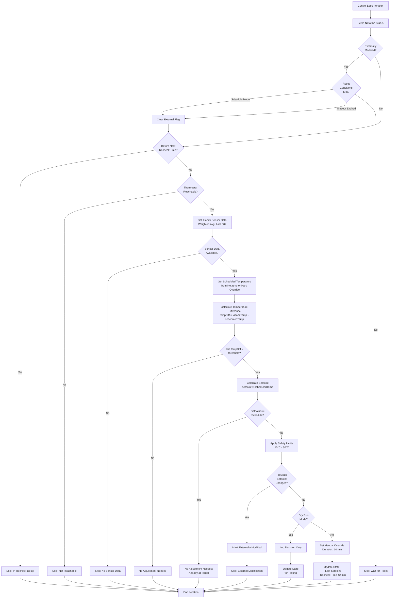
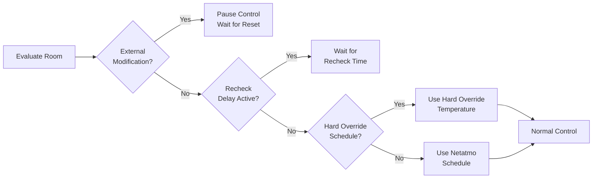
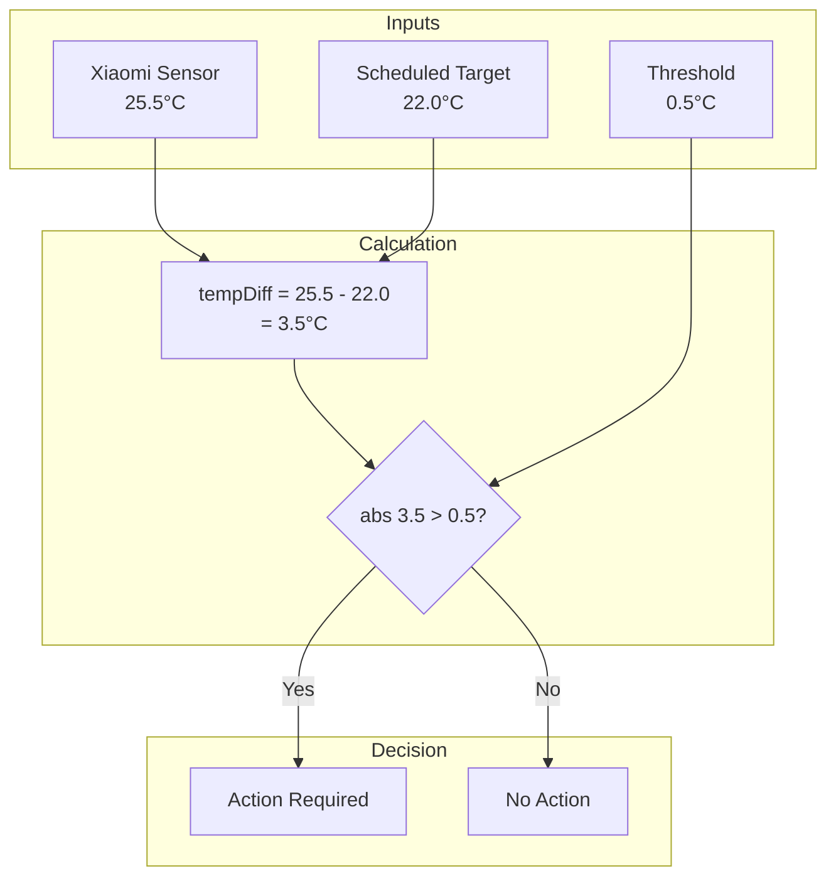
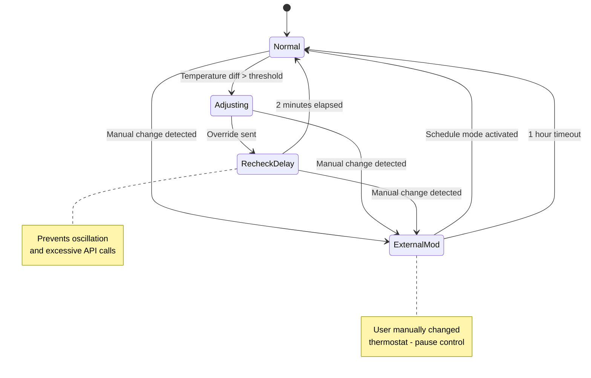
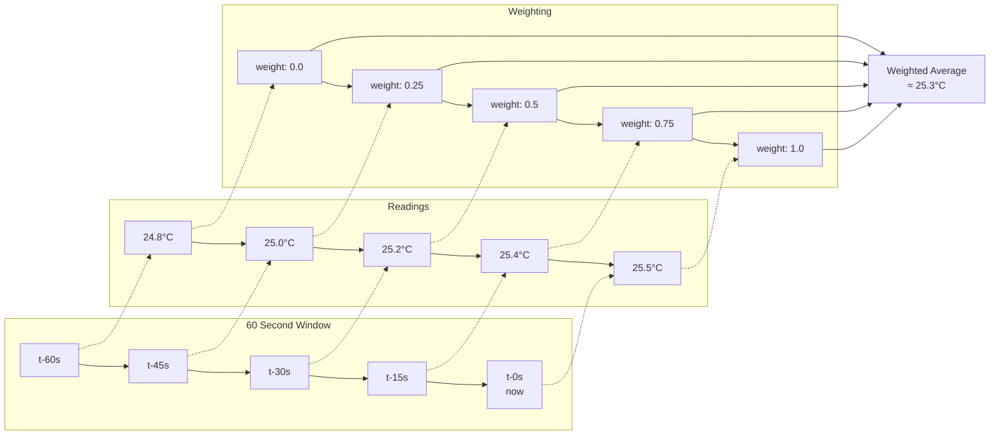
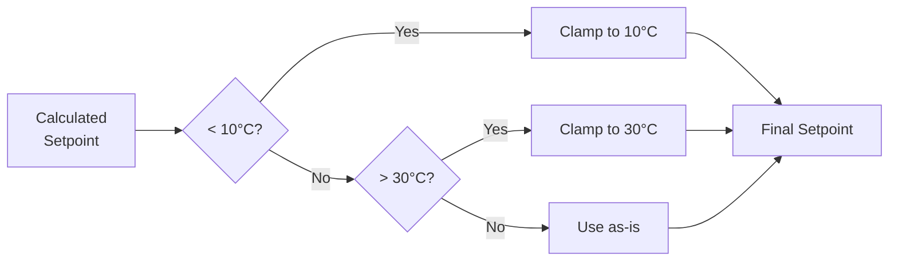
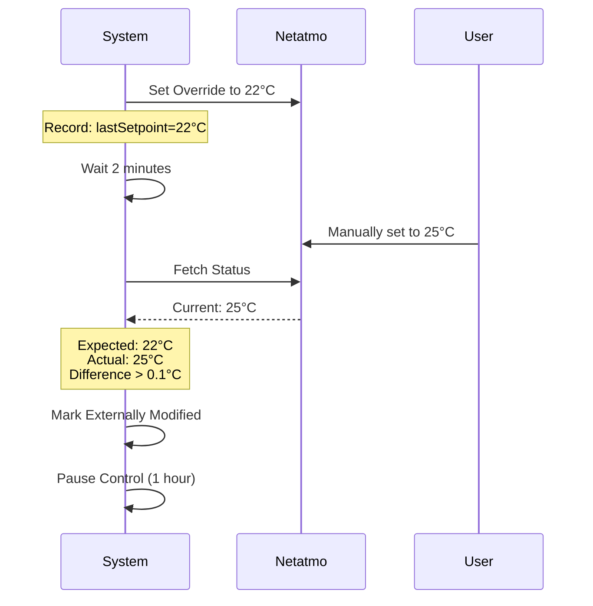

# Thermostat Control Algorithm

## Overview

The thermostat control system uses **Xiaomi BLE temperature sensors** as the authoritative source for room temperature, while delegating actual heating control to **Netatmo thermostats**. The algorithm monitors temperature deviations and only intervenes when necessary.

## Key Principles

1. **Xiaomi sensors are authoritative** - Better placement than built-in thermostat sensors
2. **Netatmo schedule is respected** - The system reads the current scheduled temperature
3. **Minimal intervention** - Only override when temperature differs significantly from target
4. **Fail-safe design** - All overrides auto-expire after 10 minutes

## Temperature Sources

The system monitors **two temperature sources** but only one drives control decisions:

### 1. Xiaomi BLE Sensors (Authoritative - Used for Control)
- **Type**: LYWSD03MMC with ATC firmware
- **Usage**: Primary input for all control decisions
- **Rationale**: Better placement than built-in thermostat sensors (typically mounted at optimal height and location in the room)
- **Processing**: Weighted average over 60-second window (see "Sensor Data Processing" section)
- **Accuracy**: Recent readings weighted more heavily than older ones

### 2. Netatmo Built-in Sensors (Monitoring Only - NOT Used for Control)
- **Type**: Built-in temperature sensor on Netatmo thermostat
- **Usage**: Captured for logging, monitoring, and metrics only
- **NOT used for control**: Only Xiaomi sensors drive temperature-based decisions
- **Purpose**:
  - Comparison and validation (detecting sensor drift)
  - Debugging and troubleshooting
  - Historical analysis and metrics
  - Future enhancement opportunities

**Why Two Sources?**

The Netatmo thermostat's built-in sensor is read from the API (`ThermMeasuredTemperature`) but intentionally **not used** for control because:
- Thermostats are often mounted near doors, corners, or heat sources (poor placement)
- Xiaomi sensors can be positioned at optimal locations (center of room, away from drafts)
- Built-in sensors may be influenced by the thermostat's own electronics

**Example Decision Log:**
```
room_name=Łazienka
xiaomi_temp=25.5          ← Used for decision
scheduled_temp=22.0       ← Target temperature
thermostat_measured=24.8  ← Logged but NOT used
action=no_adjustment_needed
```

Both temperatures are pushed to Prometheus for analysis, allowing you to monitor the delta between sensors over time.

## Control Flow



## Decision Logic

### 1. Precedence Hierarchy



### 2. Temperature Comparison



### 3. Setpoint Calculation

**Current Implementation:**

```
calculatedSetpoint = scheduledTemp
```

**Rationale:**
- The Xiaomi sensor detects the room is too warm/cold
- We want the room to reach the scheduled target temperature
- Therefore, set the thermostat to the scheduled temperature
- The Netatmo's own sensor will control heating to reach that target

**Example:**
- Xiaomi reads: 25.5°C (too warm)
- Scheduled target: 22.0°C
- Calculated setpoint: 22.0°C
- **Skip override** - already scheduled to 22°C!

## State Management



## Configuration Parameters

| Parameter | Default | Description |
|-----------|---------|-------------|
| `temperatureThreshold` | 0.5°C | Minimum difference to trigger action |
| `controlIntervalSeconds` | 60s | How often to evaluate rooms |
| `overrideDurationMinutes` | 10 min | Auto-expire time for overrides |
| `recheckDelayMinutes` | 2 min | Wait time after adjustment |
| `externalModificationResetHours` | 1 hour | Pause time after manual change |
| `minSetpointCelsius` | 10.0°C | Safety minimum |
| `maxSetpointCelsius` | 30.0°C | Safety maximum |

## Sensor Data Processing



**Formula:**
```
weight = (timestamp - cutoffTime) / (now - cutoffTime)
weightedAvg = Σ(temperature × weight) / Σ(weight)
```

Recent readings have more influence than older ones.

## Safety Features

### 1. Setpoint Clamping



### 2. Auto-Expire Override

All manual overrides automatically expire after 10 minutes, reverting to schedule mode. This ensures the system cannot get "stuck" in an override state.

### 3. External Modification Detection



## Example Scenarios

### Scenario 1: Room Too Warm

```
Input:
- Xiaomi sensor: 25.5°C (authoritative - used for control)
- Netatmo thermostat sensor: 24.8°C (logged but not used)
- Scheduled temperature: 22.0°C
- Threshold: 0.5°C

Calculation:
- tempDiff = 25.5 - 22.0 = 3.5°C (using Xiaomi only)
- abs(3.5) > 0.5 ✓
- calculatedSetpoint = 22.0°C
- calculatedSetpoint == scheduledTemp ✓

Decision: No adjustment needed (already scheduled to 22°C)
Note: Netatmo's 24.8°C reading is logged but does not affect the decision
```

### Scenario 2: Room Too Cold

```
Input:
- Xiaomi sensor: 18.5°C (authoritative - used for control)
- Netatmo thermostat sensor: 19.2°C (logged but not used)
- Scheduled temperature: 22.0°C
- Threshold: 0.5°C

Calculation:
- tempDiff = 18.5 - 22.0 = -3.5°C (using Xiaomi only)
- abs(-3.5) > 0.5 ✓
- calculatedSetpoint = 22.0°C
- calculatedSetpoint == scheduledTemp ✓

Decision: No adjustment needed (already scheduled to 22°C)
Note: Netatmo's 19.2°C reading is logged but does not affect the decision
```

### Scenario 3: Hard Override Active

```
Input:
- Xiaomi sensor: 20.5°C
- Netatmo schedule: 22.0°C
- Hard override: 19.0°C (time-based)
- Threshold: 0.5°C

Calculation:
- Use hard override as target
- tempDiff = 20.5 - 19.0 = 1.5°C
- abs(1.5) > 0.5 ✓
- calculatedSetpoint = 19.0°C
- calculatedSetpoint == scheduledTemp (19.0) ✓

Decision: No adjustment needed
```

## Monitoring Metrics

The system pushes these metrics to Prometheus:

- `thermostat_control_action` - Action taken (0=skip, 1=adjust, 2=no_adjustment)
- `thermostat_control_temperature_difference_celsius` - Xiaomi vs scheduled temp (xiaomiTemp - scheduledTemp)
- `thermostat_control_xiaomi_temperature_celsius` - Current Xiaomi reading (authoritative)
- `thermostat_control_thermostat_measured_celsius` - Netatmo built-in sensor (monitoring only)
- `thermostat_control_scheduled_temperature_celsius` - Target temperature
- `thermostat_control_calculated_setpoint_celsius` - What would be sent to thermostat
- `thermostat_control_setpoint_adjustment_celsius` - Calculated setpoint vs thermostat measured (calculatedSetpoint - thermostatMeasured)
- `thermostat_control_hard_override_active` - Hard override flag
- `thermostat_control_externally_modified` - External modification flag

**Note**: Both `xiaomi_temperature` and `thermostat_measured` are exported to Prometheus, allowing you to:
- Monitor sensor drift over time (compare xiaomi_temperature vs thermostat_measured)
- Compare sensor accuracy and detect systematic bias
- Detect sensor failures (large divergence between sensors)
- Validate Xiaomi sensor placement decisions
- Analyze how often and by how much the sensors disagree

## Dry Run Mode

When `dryRun: true`:
- All control logic executes normally
- Decisions are logged with `[DRY-RUN]` prefix
- **No API calls are made** to Netatmo
- State is still updated (for testing recheck delays)

**Example log:**
```
[DRY-RUN] WOULD set temperature (not actually sent)
  room_name=Łazienka
  new_setpoint=22
  xiaomi_temp=25.5
  scheduled_temp=22
  reason="xiaomi=25.5°C, target=22.0°C, diff=3.50°C"
```

## Future Enhancements

Potential improvements to the algorithm:

1. **PID Controller** - Proportional-Integral-Derivative control for smoother adjustments
2. **Weather Integration** - Adjust based on outdoor temperature and forecast
3. **Occupancy Detection** - Lower temperature when room is unoccupied
4. **Learning Algorithm** - Adapt to thermal characteristics of each room
5. **Multi-Sensor Averaging** - Use multiple sensors per room for accuracy
