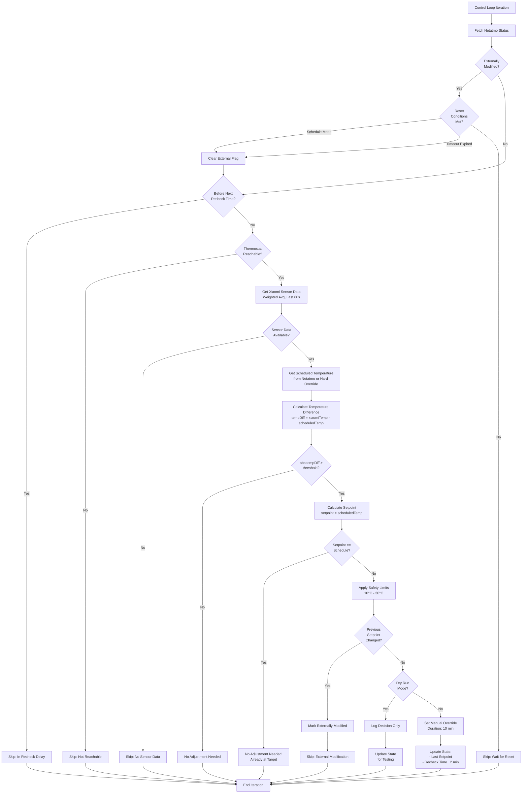
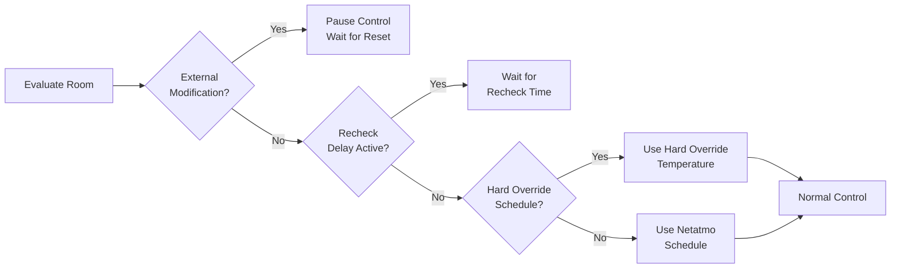
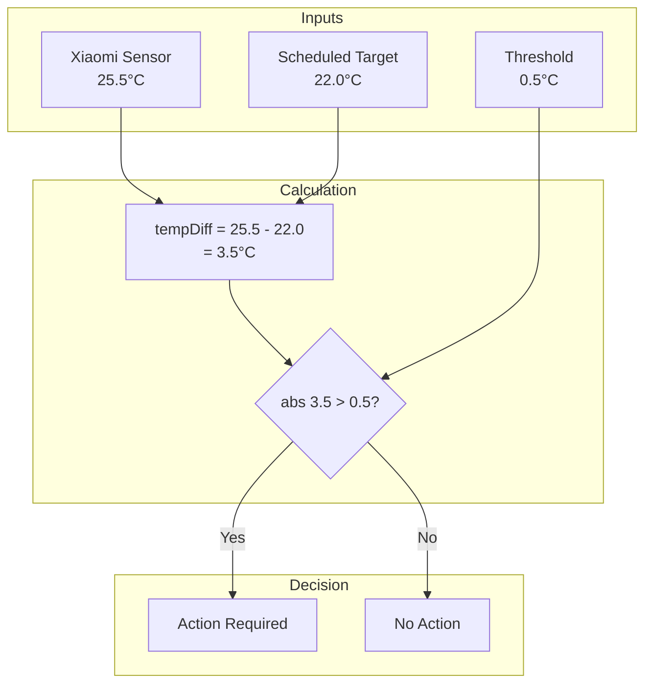
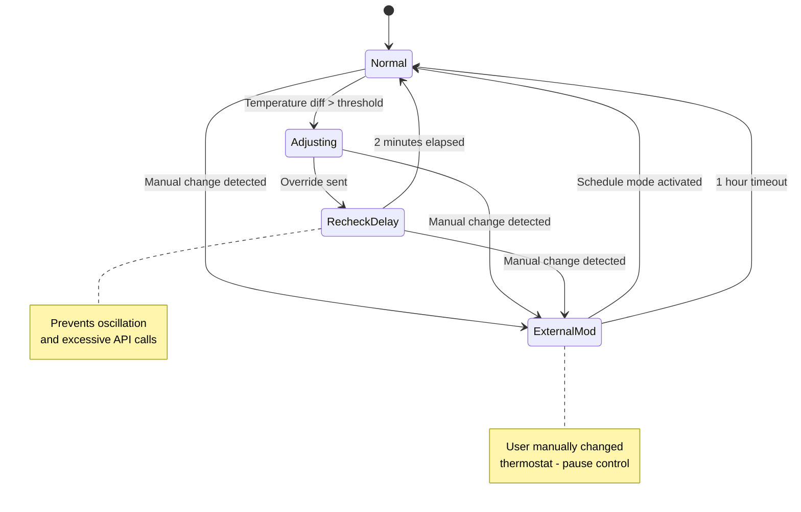
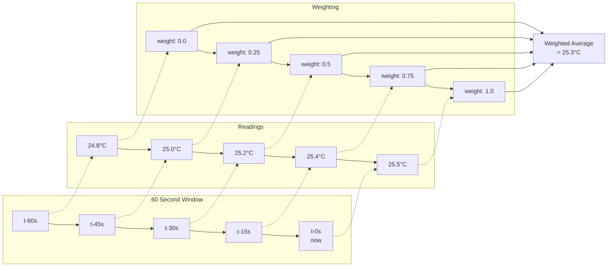
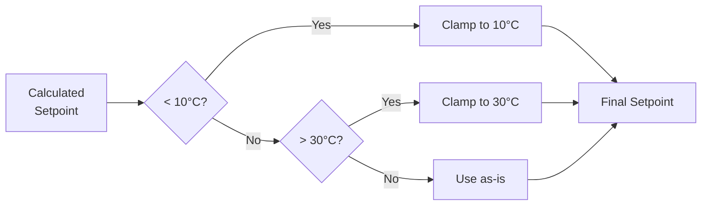
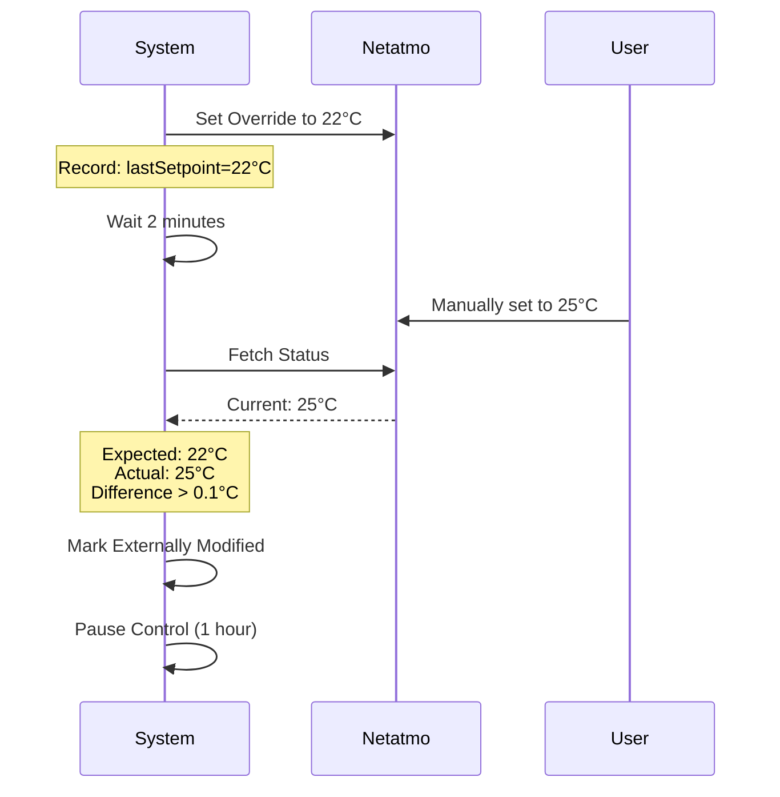

# Thermostat Control Algorithm

## Overview

The thermostat control system uses **Xiaomi BLE temperature sensors** as the authoritative source for room temperature, while delegating actual heating control to **Netatmo thermostats**. The algorithm monitors temperature deviations and only intervenes when necessary.

**Current Version: V2** - Improved schedule tracking, aggressive heating, and smarter override management.

## Key Principles

1. **Xiaomi sensors are authoritative** - Better placement than built-in thermostat sensors
2. **Netatmo schedule is tracked** - V2 stores original schedule temperature throughout manual mode
3. **Minimal intervention** - Only override when temperature differs significantly from target
4. **Fail-safe design** - All overrides auto-expire at schedule end time (V2: not fixed duration)
5. **Aggressive heating** - V2: When thermostat reaches setpoint but room cold, immediately raise by 0.5°C

## Temperature Sources

The system monitors **two temperature sources** but only one drives control decisions:

### 1. Xiaomi BLE Sensors (Authoritative - Used for Control)
- **Type**: LYWSD03MMC with ATC firmware
- **Usage**: Primary input for all control decisions
- **Rationale**: Better placement than built-in thermostat sensors (typically mounted at optimal height and location in the room)
- **Processing**: Weighted average over 60-second window (see "Sensor Data Processing" section)
- **Accuracy**: Recent readings weighted more heavily than older ones

### 2. Netatmo Built-in Sensors (Monitoring Only - NOT Used for Control)
- **Type**: Built-in temperature sensor on Netatmo thermostat
- **Usage**: Captured for logging, monitoring, and metrics only
- **NOT used for control**: Only Xiaomi sensors drive temperature-based decisions
- **Known Issue**: Netatmo sensors are **systematically inaccurate**, often reading 2-3°C higher than actual room temperature
- **Purpose**:
  - Comparison and validation (detecting sensor drift)
  - Debugging and troubleshooting
  - Historical analysis and metrics
  - Future enhancement opportunities

**Why Two Sources?**

The Netatmo thermostat's built-in sensor is read from the API (`ThermMeasuredTemperature`) but intentionally **not used** for control because:
- **Hardware inaccuracy**: Netatmo sensors consistently read higher than actual temperature (known defect)
- Thermostats are often mounted near doors, corners, or heat sources (poor placement)
- Xiaomi sensors can be positioned at optimal locations (center of room, away from drafts)
- Built-in sensors may be influenced by the thermostat's own electronics

**This is why the controller exists**: To compensate for Netatmo's faulty sensors by using accurate Xiaomi sensors as the source of truth.

**Example Decision Log:**
```
room_name=Łazienka
xiaomi_temp=25.5          ← Used for decision
scheduled_temp=22.0       ← Target temperature
thermostat_measured=24.8  ← Logged but NOT used
action=no_adjustment_needed
```

Both temperatures are pushed to Prometheus for analysis, allowing you to monitor the delta between sensors over time.

## Control Flow



## Decision Logic

### 1. Precedence Hierarchy



### 2. Temperature Comparison



### 3. Setpoint Calculation

**Current Implementation:**

The algorithm compensates for the difference between the Xiaomi sensor (authoritative) and the Netatmo's built-in sensor (which the thermostat uses for control).

**When room is too cold** (xiaomiTemp < scheduledTemp):
```
calculatedSetpoint = max(scheduledTemp, thermostatMeasured + 0.5°C)
```

**When room is too warm** (xiaomiTemp > scheduledTemp):
```
calculatedSetpoint = min(scheduledTemp, thermostatMeasured - 0.5°C)
```

**Rationale:**
- The Netatmo uses its **own built-in sensor** to decide when to heat/cool
- The built-in sensor often reads differently than the Xiaomi sensor (different location)
- **Netatmo sensors are known to be faulty**, consistently reading 2-3°C higher than actual temperature
- We must set a setpoint that triggers the correct action **on the Netatmo's sensor**
- The **0.5°C offset** ensures the thermostat actually starts/stops heating
- **Large offsets (2-5°C) are expected and normal** due to Netatmo's sensor inaccuracy - the algorithm compensates without limits

**Example 1: Room Too Cold (Sensor Offset)**
- Xiaomi reads: 23.6°C (too cold)
- Scheduled target: 24.0°C
- Thermostat's sensor: 25.0°C (reads warmer due to location)
- Temperature difference: 23.6 - 24.0 = -0.4°C (exceeds threshold)
- Calculated setpoint: max(24.0, 25.0 + 0.5) = **25.5°C**
- **Result**: Netatmo sees 25.0°C < 25.5°C → **starts heating**
- Room heats until Netatmo sensor reaches 25.5°C
- By then, Xiaomi sensor should read ~24.0°C (target reached)

**Example 2: Room Too Warm**
- Xiaomi reads: 25.5°C (too warm)
- Scheduled target: 22.0°C
- Thermostat's sensor: 24.5°C
- Temperature difference: 25.5 - 22.0 = 3.5°C (exceeds threshold)
- Calculated setpoint: min(22.0, 24.5 - 0.5) = **22.0°C**
- **Result**: Netatmo sees 24.5°C > 22.0°C → **stops heating**
- Room cools until target is reached

## State Management



## Configuration Parameters

### V2 Parameters (Current)

| Parameter | Default | Description |
|-----------|---------|-------------|
| `temperatureThreshold` | 0.5°C | Minimum difference to trigger action |
| `controlIntervalSeconds` | 60s | How often to evaluate rooms |
| `manualModeTakeoverMinutes` | 60 min | Wait time before taking control of externally-set manual mode |
| `minSetpointCelsius` | 10.0°C | Safety minimum |
| `maxSetpointCelsius` | 30.0°C | Safety maximum |

### V1 Parameters (Removed)

These parameters were removed in V2:
- `overrideDurationMinutes` (10 min) - V2 sets override to expire at schedule end time
- `recheckDelayMinutes` (2 min) - V2 evaluates every control interval without special delays
- `externalModificationResetMinutes` (5 min) - External modification pause is indefinite until schedule mode

## Sensor Data Processing



**Formula:**
```
weight = (timestamp - cutoffTime) / (now - cutoffTime)
weightedAvg = Σ(temperature × weight) / Σ(weight)
```

Recent readings have more influence than older ones.

## Safety Features

### 1. Setpoint Clamping



### 2. Auto-Expire Override

**V2 Behavior:** All manual overrides automatically expire at the **schedule end time** (not fixed duration). This aligns overrides with natural schedule transitions and eliminates the need for extension logic.

**V1 Behavior (deprecated):** Overrides expired after 10 minutes with automatic extension when needed.

### 3. External Modification Detection



## V2 Algorithm Details

### V2 Improvements Over V1

1. **Schedule Tracking**: Stores `OriginalScheduledTemp` when entering manual mode, eliminating lost schedule context
2. **Override to Schedule End**: Sets override duration to match schedule end time (not fixed 10 minutes)
3. **Aggressive Heating**: When `|setpoint - thermostat_measured| < 0.1°C` and room still cold, raises by 0.5°C immediately
4. **Maintain Mode**: When `|xiaomi - scheduled| ≤ threshold`, maintains current temperature without change
5. **Cancel Override**: When room too warm, expires override in 1 minute for quick return to schedule
6. **Manual Mode Takeover**: Waits 60 minutes before controlling externally-set manual thermostats

### V2 Control Decision Tree

```
Phase 1: Determine Scheduled Temperature
├─ Hard override active?
│  └─ Yes → use override temp, scheduleEnd = now + 24h
│  └─ No → continue
├─ Thermostat in schedule mode?
│  └─ Yes → scheduledTemp = API schedule, scheduleEnd = API scheduleEndTime
│  └─ No → continue
├─ Manual mode with OriginalScheduledTemp stored?
│  └─ Yes → scheduledTemp = stored value, scheduleEnd = stored value
│  └─ No → continue
└─ Manual mode without stored schedule (external/unknown):
   ├─ First time seeing manual? → set ManualModeSince, SKIP
   ├─ Manual < 60 min? → SKIP (waiting for takeover)
   └─ Manual ≥ 60 min? → TAKE CONTROL (use current setpoint as baseline)

Phase 2: Calculate Action
├─ Room too warm (xiaomi > scheduled + threshold)?
│  └─ ACTION: cancel_override
│     - Set to scheduledTemp
│     - Expire in 1 minute
│
├─ Within threshold (|xiaomi - scheduled| ≤ threshold)?
│  └─ ACTION: set_manual_override (maintain mode)
│     - Set to current thermostat_measured (no change)
│     - Expire at scheduleEnd
│
└─ Room too cold (xiaomi < scheduled - threshold)?
   ├─ Setpoint reached (|setpoint - thermostat_measured| < 0.1)?
   │  └─ ACTION: set_manual_override (aggressive)
   │     - Raise by +0.5°C from current setpoint
   │     - Expire at scheduleEnd
   │
   └─ Still heating:
      └─ ACTION: set_manual_override (normal)
         - Set to max(scheduledTemp, thermostat_measured + 0.5)
         - Expire at scheduleEnd
```

### V2 State Tracking

New fields in `ThermostatState`:
- `OriginalScheduledTemp`: Stores schedule when entering manual mode
- `ScheduleEndTime`: When current schedule period ends
- `ManualModeSince`: Timestamp when manual mode first detected (for takeover logic)

These fields enable schedule tracking throughout manual mode operation.

## Example Scenarios

### Scenarios Summary Table

This table shows all possible combinations of sensor readings and their outcomes:

| Scenario | Xiaomi Temp | Thermo Temp | Schedule Temp | Threshold | Calculated Setpoint | Override Needed? | Outcome |
|----------|-------------|-------------|---------------|-----------|---------------------|------------------|---------|
| 1. Room too warm, thermo reads warm too<br/>(No intervention) | 25.5°C | 24.8°C | 22.0°C | 0.5°C | 22.0°C | NO | Thermo naturally stops heating (24.8 > 22.0) |
| 2. Room too cold, thermo reads cold too<br/>(No intervention) | 18.5°C | 19.2°C | 22.0°C | 0.5°C | 22.0°C | NO | Thermo naturally heats (19.2 < 22.0) |
| 3. Room too cold, thermo reads WARM<br/>(CRITICAL - Must override) | 23.6°C | 25.0°C | 24.0°C | 0.3°C | 25.5°C | **YES** | **CRITICAL:** Must force heating via override |
| 4. Room too cold, large thermo offset<br/>(Override required) | 20.0°C | 24.0°C | 22.0°C | 0.5°C | 24.5°C | **YES** | Large offset requires significant adjustment |
| 5. Room too warm, thermo reads COLD<br/>(CRITICAL - Must override) | 24.0°C | 21.0°C | 22.0°C | 0.5°C | 20.5°C | **YES** | **CRITICAL:** Must stop heating via override |
| 6. Room too warm, moderate thermo offset<br/>(No intervention) | 25.5°C | 23.0°C | 22.0°C | 0.5°C | 22.0°C | NO | Schedule sufficient, thermo will stop |
| 7. Room too warm, large thermo offset<br/>(No intervention) | 26.0°C | 25.0°C | 22.0°C | 0.5°C | 22.0°C | NO | Schedule sufficient even with large offset |
| 8. Within threshold<br/>(No action) | 24.2°C | 24.5°C | 24.0°C | 0.3°C | N/A | NO | Difference too small (0.2°C < 0.3°C) |

**Key Patterns:**
- **CRITICAL cases** (scenarios 3 & 5): Sensors disagree on temperature direction → **override required**
- **No intervention** (scenarios 1, 2, 6, 7): Schedule alone will work → **no override needed**
- **Large offsets** (scenario 4): Even if both sensors agree on direction, large offset needs compensation

**Algorithm Logic:**
```
When room TOO COLD:    setpoint = max(schedule, thermoMeasured + 0.5°C)
When room TOO WARM:    setpoint = min(schedule, thermoMeasured - 0.5°C)
Override sent if:      abs(setpoint - schedule) >= 0.1°C
```

### Detailed Scenario Descriptions

### Scenario 1: Room Too Warm

```
Input:
- Xiaomi sensor: 25.5°C (authoritative - used for control)
- Netatmo thermostat sensor: 24.8°C (used to calculate setpoint)
- Scheduled temperature: 22.0°C
- Threshold: 0.5°C

Calculation:
- tempDiff = 25.5 - 22.0 = 3.5°C (using Xiaomi only)
- abs(3.5) > 0.5 ✓ (exceeds threshold, intervention needed)
- Room is too warm, so: calculatedSetpoint = min(22.0, 24.8 - 0.5)
- calculatedSetpoint = min(22.0, 24.3) = 22.0°C
- calculatedSetpoint == scheduledTemp ✓ (within 0.1°C)

Decision: No adjustment needed (already scheduled to 22°C, which is below thermostat's reading)
Note: The thermostat will naturally stop heating since its sensor (24.8°C) is above schedule (22.0°C)
```

### Scenario 2: Room Too Cold (No Sensor Offset)

```
Input:
- Xiaomi sensor: 18.5°C (authoritative - used for control)
- Netatmo thermostat sensor: 19.2°C (used to calculate setpoint)
- Scheduled temperature: 22.0°C
- Threshold: 0.5°C

Calculation:
- tempDiff = 18.5 - 22.0 = -3.5°C (using Xiaomi only)
- abs(-3.5) > 0.5 ✓ (exceeds threshold, intervention needed)
- Room is too cold, so: calculatedSetpoint = max(22.0, 19.2 + 0.5)
- calculatedSetpoint = max(22.0, 19.7) = 22.0°C
- calculatedSetpoint == scheduledTemp ✓ (within 0.1°C)

Decision: No adjustment needed (already scheduled to 22°C, which is above thermostat's reading)
Note: The thermostat will naturally heat since its sensor (19.2°C) is below schedule (22.0°C)
```

### Scenario 3: Room Too Cold WITH Sensor Offset (Manual Override Required)

This is the critical case where the algorithm must intervene.

```
Input:
- Xiaomi sensor: 23.6°C (authoritative - room is actually cold)
- Netatmo thermostat sensor: 25.0°C (reads warmer, poor placement)
- Scheduled temperature: 24.0°C
- Threshold: 0.3°C

Calculation:
- tempDiff = 23.6 - 24.0 = -0.4°C (using Xiaomi only)
- abs(-0.4) > 0.3 ✓ (exceeds threshold, intervention needed)
- Room is too cold, so: calculatedSetpoint = max(24.0, 25.0 + 0.5)
- calculatedSetpoint = max(24.0, 25.5) = 25.5°C
- calculatedSetpoint != scheduledTemp (25.5 != 24.0)

Decision: Set manual override to 25.5°C for 10 minutes
Reason: "xiaomi=23.6°C, target=24.0°C, diff=-0.40°C"

Result:
- Override sent: 25.5°C
- Netatmo sees: its sensor reads 25.0°C, target is 25.5°C
- Netatmo decision: 25.0 < 25.5 → START HEATING ✓
- Room heats up
- When Netatmo sensor reaches 25.5°C, Xiaomi should read ~24.0°C
- Override expires after 10 minutes, returns to schedule

Why this works:
- Without override: Netatmo sees 25.0°C > 24.0°C → won't heat (room stays cold)
- With override: Netatmo sees 25.0°C < 25.5°C → heats (room reaches target)
```

### Scenario 4: Room Too Warm WITH Sensor Offset (Manual Override Required)

This demonstrates the critical case where the room is warm but the thermostat sensor reads cold.

```
Input:
- Xiaomi sensor: 24.0°C (authoritative - room is actually too warm)
- Netatmo thermostat sensor: 21.0°C (reads cold, maybe near open window/draft)
- Scheduled temperature: 22.0°C
- Threshold: 0.5°C

The Problem:
Without our algorithm, if we naively set setpoint = scheduledTemp = 22.0°C:
- Netatmo sees: 21.0°C < 22.0°C
- Netatmo decision: KEEP HEATING ❌
- Result: Room gets even warmer (disaster!)

Our Algorithm's Solution:
- tempDiff = 24.0 - 22.0 = 2.0°C
- abs(2.0) > 0.5 ✓ (exceeds threshold, intervention needed)
- Room is too warm, so: calculatedSetpoint = min(22.0, 21.0 - 0.5)
- calculatedSetpoint = min(22.0, 20.5) = 20.5°C ← BELOW schedule!
- calculatedSetpoint != scheduledTemp (20.5 != 22.0)

Decision: Set manual override to 20.5°C for 10 minutes
Reason: "xiaomi=24.0°C, target=22.0°C, diff=2.00°C"

Result:
- Override sent: 20.5°C
- Netatmo sees: its sensor reads 21.0°C, target is 20.5°C
- Netatmo decision: 21.0 > 20.5 → STOP HEATING ✓
- Room cools down naturally
- When Netatmo sensor drops to 20.5°C, Xiaomi should read ~22.0°C
- Override expires after 10 minutes, returns to schedule

Why this works:
- The 0.5°C offset below thermostat reading guarantees heating will stop
- Without override: Thermostat would keep heating a room that's already too warm
- With override: Thermostat stops heating, room cools to target
```

### Scenario 5: Room Too Warm, No Override Needed

Not all warm room scenarios require intervention.

```
Input:
- Xiaomi sensor: 25.5°C (authoritative - room is warm)
- Netatmo thermostat sensor: 23.0°C (reads cooler than reality)
- Scheduled temperature: 22.0°C
- Threshold: 0.5°C

Calculation:
- tempDiff = 25.5 - 22.0 = 3.5°C
- abs(3.5) > 0.5 ✓ (exceeds threshold, intervention considered)
- Room is too warm, so: calculatedSetpoint = min(22.0, 23.0 - 0.5)
- calculatedSetpoint = min(22.0, 22.5) = 22.0°C
- calculatedSetpoint == scheduledTemp ✓ (within 0.1°C)

Decision: No adjustment needed
Reason: "calculated setpoint (22.0°C) matches schedule, no override needed"

Why no override is needed:
- The thermostat's sensor reads 23.0°C
- The scheduled target is 22.0°C
- Netatmo sees: 23.0 > 22.0 → will naturally STOP HEATING ✓
- Even though the room is actually warmer (25.5°C), the thermostat will do the right thing
- The schedule is sufficient; no manual intervention required
```

### Scenario 6: Room Too Cold, Large Sensor Offset (Manual Override Required)

This demonstrates a large offset where both sensors agree on direction (cold) but the magnitude requires intervention. **This is a common scenario** because Netatmo sensors are known to read 2-3°C higher than actual temperature.

```
Input:
- Xiaomi sensor: 20.0°C (authoritative - room is cold, accurate reading)
- Netatmo thermostat sensor: 24.0°C (reads 4°C warmer - FAULTY SENSOR)
- Scheduled temperature: 22.0°C
- Threshold: 0.5°C

Calculation:
- tempDiff = 20.0 - 22.0 = -2.0°C
- abs(-2.0) > 0.5 ✓ (exceeds threshold, intervention needed)
- Room is too cold, so: calculatedSetpoint = max(22.0, 24.0 + 0.5)
- calculatedSetpoint = max(22.0, 24.5) = 24.5°C
- calculatedSetpoint != scheduledTemp (24.5 != 22.0)

Decision: Set manual override to 24.5°C for 10 minutes
Reason: "xiaomi=20.0°C, target=22.0°C, diff=-2.00°C"

Result:
- Override sent: 24.5°C
- Netatmo sees: its sensor reads 24.0°C, target is 24.5°C
- Netatmo decision: 24.0 < 24.5 → START HEATING ✓
- Room heats up
- When Netatmo sensor reaches 24.5°C, Xiaomi should read ~22.0°C
- Override expires after 10 minutes, returns to schedule

Note:
- Large sensor offset (4°C difference) is **EXPECTED** due to Netatmo's faulty sensors
- This is exactly why this controller exists - to compensate for broken Netatmo sensors
- The algorithm has **no upper limit** on offset compensation because large offsets are normal
- Without override: Schedule would be 22°C, but thermostat reads 24°C → no heating (room stays cold)
```

### Scenario 6b: Extreme Large Sensor Offset (Real-World Example)

This is a real scenario that was logged in production, demonstrating why unlimited offset compensation is necessary.

```
Input:
- Xiaomi sensor: 23.5°C (authoritative - room slightly cold)
- Netatmo thermostat sensor: 26.0°C (reads 2.5°C warmer - FAULTY SENSOR)
- Scheduled temperature: 24.0°C
- Threshold: 0.3°C

The Problem (Before Fix):
The system previously had a "safety check" that would skip adjustment when sensors disagreed about
whether the room was above/below target. This caused the following bad behavior:
- Xiaomi: 23.5°C < 24.0°C (room is cold, needs heating)
- Netatmo: 26.0°C > 24.0°C (thermostat thinks room is warm)
- Old logic: SKIP adjustment (sensors disagree)
- Result: Room stays cold ❌

Our Algorithm's Solution (After Fix):
- tempDiff = 23.5 - 24.0 = -0.5°C
- abs(-0.5) > 0.3 ✓ (exceeds threshold)
- Room is too cold, so: calculatedSetpoint = max(24.0, 26.0 + 0.5)
- calculatedSetpoint = max(24.0, 26.5) = 26.5°C
- calculatedSetpoint != scheduledTemp (26.5 != 24.0)

Decision: Set manual override to 26.5°C for 10 minutes
Reason: "xiaomi=23.5°C, target=24.0°C, diff=-0.50°C"

Result:
- Override sent: 26.5°C
- Netatmo sees: its sensor reads 26.0°C, target is 26.5°C
- Netatmo decision: 26.0 < 26.5 → START HEATING ✓
- Room heats up from actual 23.5°C
- When Netatmo sensor reaches 26.5°C, Xiaomi should read ~24.0°C ✓
- Override expires after 10 minutes, returns to schedule

Why This Works:
- Xiaomi is ALWAYS the source of truth
- Netatmo's faulty sensor reading is irrelevant for decision-making
- The algorithm compensates for ANY size offset (no limits)
- This is the entire purpose of this controller
```

### Scenario 7: Within Threshold - No Action Required

This demonstrates the temperature threshold preventing unnecessary interventions.

```
Input:
- Xiaomi sensor: 24.2°C (slightly above target)
- Netatmo thermostat sensor: 24.5°C
- Scheduled temperature: 24.0°C
- Threshold: 0.3°C

Calculation:
- tempDiff = 24.2 - 24.0 = 0.2°C
- abs(0.2) < 0.3 ✗ (below threshold)

Decision: No action - skip evaluation
Reason: "temperature difference 0.20°C below threshold 0.30°C"

Why no action:
- The 0.2°C difference is within acceptable range
- Prevents constant micro-adjustments
- Reduces API calls and override churn
- Allows natural temperature fluctuation

The temperatureThreshold parameter controls this behavior:
- Lower values (0.2-0.3°C): More responsive but more interventions
- Higher values (0.5-1.0°C): Less responsive but fewer interventions
- Recommended: 0.3-0.5°C for home heating
```

### Scenario 8: Hard Override Active

```
Input:
- Xiaomi sensor: 20.5°C
- Netatmo schedule: 22.0°C
- Hard override: 19.0°C (time-based)
- Threshold: 0.5°C

Calculation:
- Use hard override as target
- tempDiff = 20.5 - 19.0 = 1.5°C
- abs(1.5) > 0.5 ✓
- calculatedSetpoint = 19.0°C
- calculatedSetpoint == scheduledTemp (19.0) ✓

Decision: No adjustment needed
```

## Monitoring Metrics

The system pushes these metrics to Prometheus:

- `thermostat_control_action` - Action taken (0=skip, 1=adjust, 2=no_adjustment)
- `thermostat_control_temperature_difference_celsius` - Xiaomi vs scheduled temp (xiaomiTemp - scheduledTemp)
- `thermostat_control_xiaomi_temperature_celsius` - Current Xiaomi reading (authoritative)
- `thermostat_control_thermostat_measured_celsius` - Netatmo built-in sensor (monitoring only)
- `thermostat_control_scheduled_temperature_celsius` - Target temperature
- `thermostat_control_calculated_setpoint_celsius` - What would be sent to thermostat
- `thermostat_control_setpoint_adjustment_celsius` - Calculated setpoint vs thermostat measured (calculatedSetpoint - thermostatMeasured)
- `thermostat_control_hard_override_active` - Hard override flag
- `thermostat_control_externally_modified` - External modification flag

**Note**: Both `xiaomi_temperature` and `thermostat_measured` are exported to Prometheus, allowing you to:
- Monitor sensor drift over time (compare xiaomi_temperature vs thermostat_measured)
- Compare sensor accuracy and detect systematic bias
- Detect sensor failures (large divergence between sensors)
- Validate Xiaomi sensor placement decisions
- Analyze how often and by how much the sensors disagree

## Dry Run Mode

When `dryRun: true`:
- All control logic executes normally
- Decisions are logged with `[DRY-RUN]` prefix
- **No API calls are made** to Netatmo
- State is still updated (for testing recheck delays)

**Example log:**
```
[DRY-RUN] WOULD set temperature (not actually sent)
  room_name=Łazienka
  new_setpoint=22
  xiaomi_temp=25.5
  scheduled_temp=22
  reason="xiaomi=25.5°C, target=22.0°C, diff=3.50°C"
```

## Future Enhancements

Potential improvements to the algorithm:

1. **PID Controller** - Proportional-Integral-Derivative control for smoother adjustments
2. **Weather Integration** - Adjust based on outdoor temperature and forecast
3. **Occupancy Detection** - Lower temperature when room is unoccupied
4. **Learning Algorithm** - Adapt to thermal characteristics of each room
5. **Multi-Sensor Averaging** - Use multiple sensors per room for accuracy
