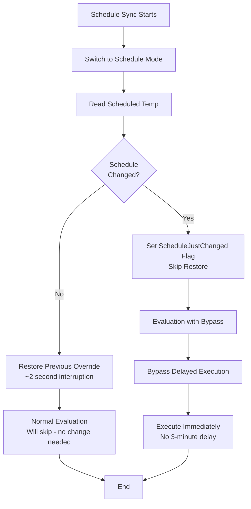

# Schedule Sync: Hybrid Approach

## Problem Solved

**Original Issue:** Schedule sync was canceling active overrides, creating 3-minute gaps where thermostat returned to schedule mode before re-evaluating.

**Timeline of Bug:**
```
10:57:30 - Extension sent (24°C, expires 11:12:30)
11:00:34 - Schedule sync switches to schedule mode → Override canceled!
11:00:35 - Delayed execution marks pending
11:03:30 - Delayed execution confirms → Sends new override
Result: 3-minute gap at wrong temperature (24.5°C instead of 24°C)
```

## Solution: Hybrid Restore vs Re-evaluate

The system now intelligently decides whether to restore the previous override or re-evaluate based on whether the schedule changed.

### Decision Logic

```
After reading schedule temperature:

IF schedule UNCHANGED (e.g., 24.5°C → 24.5°C):
  ✓ Restore previous override immediately
  ✓ No re-evaluation needed
  ✓ Total interruption: ~2 seconds
  ✓ No extra API calls

IF schedule CHANGED (e.g., 24.5°C → 22.0°C):
  ✓ Skip restore
  ✓ Set ScheduleJustChanged flag
  ✓ Bypass delayed execution
  ✓ Re-evaluate immediately with new schedule
  ✓ Execute new override without 3-minute delay
```

## Implementation Details

### New Data Structures

**PreviousOverride** (sync.go:71-78)
```go
type PreviousOverride struct {
    RoomID           string
    Setpoint         float64
    EndTime          time.Time
    WasActive        bool
    ScheduleChanged  bool  // Track schedule changes
}
```

**ThermostatState** (types.go:34)
```go
type ThermostatState struct {
    // ... existing fields ...
    ScheduleJustChanged bool // Bypass delayed execution once
}
```

### Flow Diagram



### Key Functions

**1. switchRoomsToScheduleMode** (sync.go:84-179)
- Stores previous override state (setpoint, endtime)
- Returns `previousOverrides` map

**2. pollUntilAllRoomsSynced** (sync.go:184-261)
- Compares new schedule with previous synced temp
- Sets `ScheduleChanged` flag if difference > 0.1°C
- Sets `ScheduleJustChanged` in state if changed

**3. restorePreviousOverrides** (sync.go:265-330)
- Checks `ScheduleChanged` flag
- **If false**: Restores override with remaining duration
- **If true**: Skips restoration (logs "will re-evaluate")

**4. checkDelayedExecution** (evaluate.go:508-544)
- Checks `ScheduleJustChanged` flag
- **If true**: Clears flag, bypasses delayed execution, returns immediately
- **If false**: Normal delayed execution logic

## Examples

### Example 1: Schedule Unchanged (Most Common)

```
Time          | Action                           | Result
------------- | -------------------------------- | -------
10:57:30      | Override active: 24°C           | Manual mode
11:00:00      | Schedule sync starts            |
11:00:02      | Read schedule: 24.5°C           | Same as before ✓
11:00:02      | Compare: 24.5 == 24.5           | No change detected
11:00:03      | Restore override: 24°C (9 min)  | Manual mode restored
11:00:30      | Evaluation: already at 24°C     | No action needed
Result: 2-second interruption, no re-evaluation, 1 extra API call
```

### Example 2: Schedule Changed (Rare but Important)

```
Time          | Action                           | Result
------------- | -------------------------------- | -------
10:57:30      | Override active: 24°C           | Manual mode
11:00:00      | Schedule sync starts            |
11:00:02      | Read schedule: 22.0°C           | CHANGED! (was 24.5°C)
11:00:02      | Compare: 22.0 != 24.5           | Change detected ✓
11:00:03      | Set ScheduleJustChanged=true    |
11:00:03      | Skip restore                    | Schedule mode
11:00:30      | Evaluation starts               |
11:00:30      | Bypass delayed execution        | ScheduleJustChanged=true
11:00:30      | Calculate new override: 22.5°C  |
11:00:30      | Execute immediately             | Manual mode, 22.5°C
Result: Immediate response to schedule change, no 3-minute delay
```

### Example 3: First Sync (Bootstrap)

```
Time          | Action                           | Result
------------- | -------------------------------- | -------
10:00:00      | First sync (no previous)        |
10:00:02      | Read schedule: 24.5°C           | First time
10:00:02      | Compare: 0 vs 24.5              | No previous to compare
10:00:02      | ScheduleChanged=false           | Treat as "unchanged"
10:00:03      | Restore override if active      | Normal restore
Result: Bootstrap case handled gracefully
```

## Benefits

1. **Minimal Interruption**: Only ~2 seconds when schedule unchanged (vs 3 minutes before)
2. **Immediate Response**: No delay when schedule changes (bypasses delayed execution)
3. **Efficient**: No extra evaluation when schedule unchanged
4. **Intelligent**: Automatically detects which path to take

## Testing

### Unit Tests (sync_hybrid_test.go)

Three comprehensive test cases:

1. **TestScheduleSync_HybridBehavior_Unchanged**
   - Schedule stays at 24.5°C
   - Verifies override is restored
   - Verifies no bypass flag set

2. **TestScheduleSync_HybridBehavior_Changed**
   - Schedule changes from 24.5°C to 22.0°C
   - Verifies override is NOT restored
   - Verifies bypass flag is set
   - Verifies delayed execution is bypassed

3. **TestScheduleSync_HybridBehavior_FirstSync**
   - No previous sync exists
   - Verifies treated as "unchanged"
   - Verifies override is restored

### Integration Testing

**Scenario 1: Daily schedule change**
```bash
# Set schedule to change at 11:00
# Monitor logs from 10:55 to 11:05
grep "schedule.*changed\|restored previous override" logs.txt

# Expected: At 11:00 sync, see "schedule changed" → immediate override
```

**Scenario 2: Stable schedule with continuous override**
```bash
# Monitor for 1 hour with stable schedule
# Count "restored previous override" messages
grep "restored previous override" logs.txt | wc -l

# Expected: 4 messages (every 15 minutes), no gaps
```

## Monitoring

### Log Messages

**Schedule Unchanged:**
```
schedule synced for room, schedule_changed=false
stored previous override to restore after sync
restored previous override after schedule sync
```

**Schedule Changed:**
```
schedule temperature changed, previous=24.5, new=22.0
schedule synced for room, schedule_changed=true
schedule changed, skipping restore (will re-evaluate)
delayed execution: bypassing for schedule change
```

### Metrics

Monitor for oscillations:
```promql
# Should be constant (no schedule mode gaps)
thermostat_mode{room="Bathroom"} == "manual"

# Should not spike after sync
rate(thermostat_control_action[5m])
```

## Configuration

**Recommended Settings:**
```yaml
scheduleSyncIntervalMinutes: 15    # Frequent enough to catch schedule changes
extensionThresholdMinutes: 4       # Extension before expiry
overrideDurationMinutes: 15        # Long enough to span sync intervals
controlLoopCron: "30 */3 * * * *"  # Every 3 minutes
```

**Why 15-minute sync interval?**
- Most schedules change hourly or less frequently
- 15 minutes provides good balance between API calls and responsiveness
- 4 syncs per hour = negligible extra API usage

## Migration Notes

**From Previous Version:**
- No breaking changes to configuration
- Existing overrides will be handled gracefully
- First sync after upgrade will bootstrap schedule tracking
- No manual intervention required

## Troubleshooting

**Problem: Override still interrupted for 3 minutes**
- Check logs for "schedule changed" - might be legitimate change
- Verify `scheduleSyncIntervalMinutes` is not 0
- Check if delayed execution is working correctly

**Problem: Schedule changes not detected**
- Verify schedule sync is running every 15 minutes
- Check comparison threshold (0.1°C) is appropriate
- Review `SyncedScheduledTemp` in state

**Problem: Too many API calls**
- Check restore is not failing and retrying
- Verify schedule is not oscillating (Netatmo bug)
- Consider increasing sync interval to 30 minutes

## Related Files

- `control/sync.go` - Main sync logic
- `control/types.go` - State structures
- `control/evaluate.go` - Delayed execution bypass
- `control/sync_hybrid_test.go` - Unit tests
- `config.yaml` - Configuration

## Future Enhancements

1. **Adaptive sync frequency**: Sync more often during known schedule change times
2. **Schedule prediction**: Learn daily patterns to pre-sync before changes
3. **Multi-room optimization**: Group syncs to minimize API calls
4. **Confidence scoring**: Track schedule stability to optimize sync strategy
